# Table of Contents

# Testing
The testing approach(described in detail in this testing readme) is as follows:
1. Automated unit testing using the Django unit test framework
2. Automated UI testing using the UILIcious framework
3. Manual testing using emulators and real devices

## Unit testing information
- I wrote a number of unit tests(65) using the Django unit test framework
- These test cases are structured in a number of suites(13)
- The structure of the unit test is based on the model/form/view structure, for example test_views.py, test_model.py and test_forms.py on a per app basis
- I used coverage(coverage.py) for code coverage and to ensure a high code coverage was met on all python files in the project
- An overall report is available at the following link [Coverage Report](readme/coverage/index.html)
- To run the unit tests click on Run "Test with Coverage" in your IDE, or at the command line "python manage.py test"
 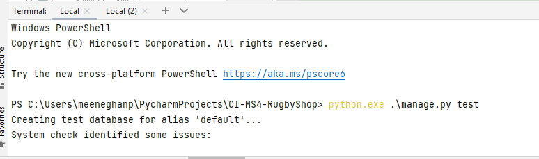
- A tests database is created and deleted for the test run, and each suite has setup:<code>def setUp(self):</code> and teardown:<code>def tearDown(self):</code> methods to create 
the relevant objects needed for the test suite
 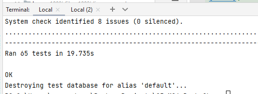

### Unit testing information for the Bag app
- For the bag app one suite was written to test the views
- The bag app does not have any forms or models
- The views suite contains 8 unit tests testing add/removing items from the bag
 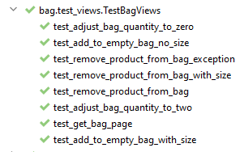
- In terms of coverage when run as part of the 13 suites, it gives the following code coverage
 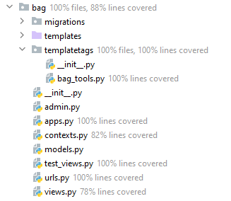

### Unit testing information for the Checkout app
- For the checkout app three suites were written to test the views, form and models
- The suites contain 3 unit tests testing the order creation and forms
 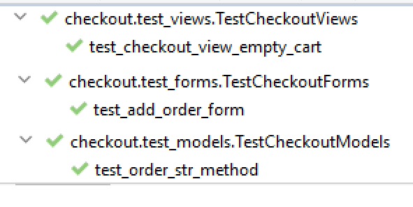
- In terms of coverage when run as part of the 13 suites, it gives the following code coverage
 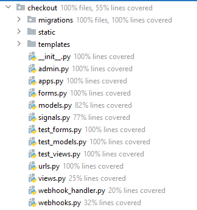

### Unit testing information for the Favourites app
- For the favourites app two suites were written to test the views and models
- The favourites app does not have any forms
- The two suites contain 8 unit tests testing adding and removing favourites
 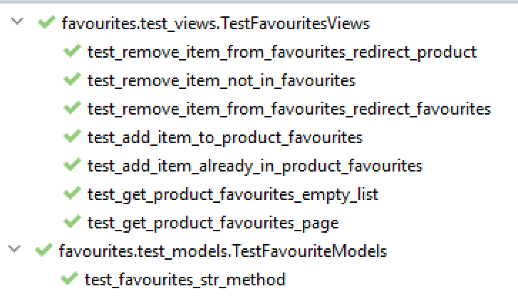
- In terms of coverage when run as part of the 13 suites, it gives the following code coverage
 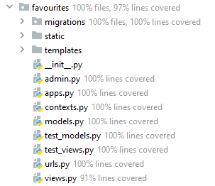

### Unit testing information for the Home app
- For the home app one suite was written to test the views
- The home app does not have any forms or models
- The suite contains 1 unit tests testin the home page template
 
- In terms of coverage when run as part of the 13 suites, it gives the following code coverage
 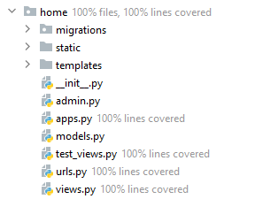

### Unit testing information for the News app
- For the news app two suites were written to test the views and models
- The forms are tested as part of these suites
- The two suites contain 17 unit tests testing add/modify/views and delete of news items and comments
 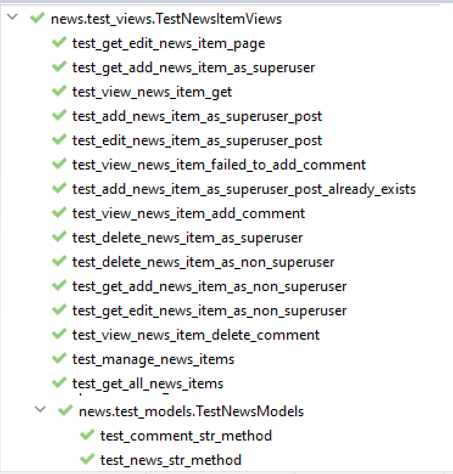
- In terms of coverage when run as part of the 13 suites, it gives the following code coverage
 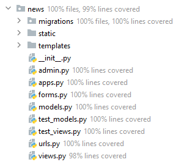

### Unit testing information for the Products app
- For the products app two suites were written to test the views and models
- The forms are tested as part of these suites
- The two suites contain 24 unit tests testing add/modify/views and delete of reviews and products
 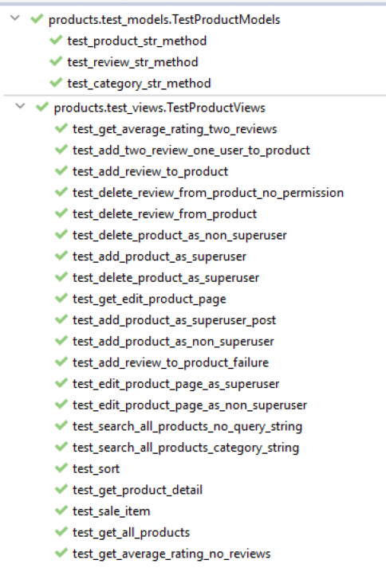
- In terms of coverage when run as part of the 13 suites, it gives the following code coverage
 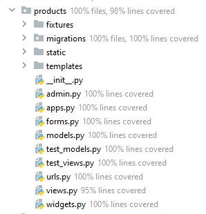

### Unit testing information for the Profile app
- For the products app two suites were written to test the views and models
- The forms are tested as part of these suites
- The two suites contain 4 unit tests testing the users profile and profile updates
 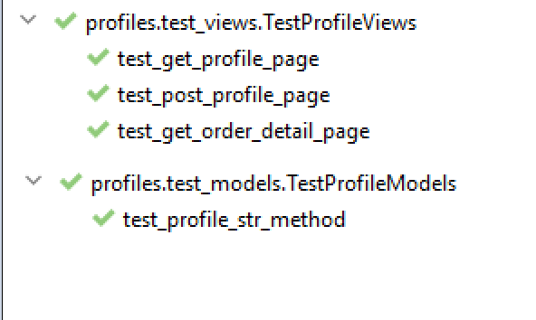
- In terms of coverage when run as part of the 13 suites, it gives the following code coverage
 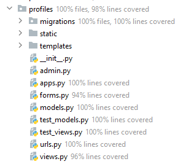

## Automated UI testing information
- I wrote a simple automated e2e testing on UILIcious(www.uilicious.com)
- The test accesses all pages and ensures the simple e2e flow of accessing all pages is successful
- Below are screenshots of the tests(steps and results) running on UILicious(Desktop, Chrome and Mozilla Firefox)

## Manual testing information
Testing was completed on the following browsers and device types

Device Number | Physical/Emulator | Device Name | Device Type | Browser | Version
------------ | ------------ | ------------- | ------------- | ------------- | -------------
1 | Physical | iPad | Tablet |  Safari | 14.4 |
2 | Physical | iPhone | Mobile |Safari | 14.4 |
3 | Physical | One Plus 5 | Mobile | Chrome | 94.0 |
4 | Physical | Windows Desktop| Desktop | IE Edge | 42.0 |
5 | Physical | Windows Desktop| Desktop | Mozilla Firefox | 85.0 |
6 | Physical | Windows Desktop| Desktop | Chrome | 94.0 |
7 | Emulator | Galaxy S5 | Mobile | Chrome Emulator | 94.0 |
8 | Emulator | iPad | Tablet | Chrome Emulator | 94.0 |
9 | Emulator | iPhone X | Mobile | Chrome Emulator | 94.0 |
10 | Emulator | iPhone 5/SE | Mobile | Chrome Emulator | 94.0 |

- Below are the test results for testing the website requirements against a range of browsers and devices
- For the purpose of the screenshots I used a Chrome emulator for desktop, tablet and mobile (Device numbers 6(Desktop), 8(Tablet), 9(Mobile))

## Feature 1 Navigation Bar
### User Story 1-1

### Test case steps 1-1

### Expected Result 1-1
1. The home/index page will be displayed with logo and navigation bar, with a burger menu on mobile devices

### Actual Result 1-1
Step Number | Desktop | Tablet | Mobile | Result 
------------ | ------------ | ------------- | ------------- | ------------- |
Step 1 | [Desktop Result](football_memories/static/images/testing/index_desktop.png)  | [Tablet Result](football_memories/static/images/testing/index_tablet.png) |[Mobile Result](football_memories/static/images/testing/index_mobile.png) | Passed |

## Feature 2 Footer

## Feature 3 Landing Home page

# Bugs found during the testing phase

Bug no. | Bug description |  Bug fix |
------------ | ------------- | ------------- |
1 | When running html validation, sales_items had same id as news, | The fix was to give both a unique id (main-nav.html)
2 | When running html validation, alt text for a number of images in a loop was the same | The fix was the set it to the product name (products.html) |
3 | If a user has 0 favourites, pagination setup call in the view is being called even though there are no items | The fix was to move the location of the pagination setup call(util.py) |
4 | Ths stripe webhook was not working on production. I had the same secret set on heroku and local development, even though I had two different webhooks defined(development and production) |The fix was to set the correct webhook secret as an enviroment variable in Heroku
5 | The following error was displayed in logs norderedObjectListWarning: Pagination may yield inconsistent results with an unordered object_list: <class 'products.models.Product'> QuerySet.| The fix was to update the product and review models to order by id (models.py in Product app)

# Code Validators and Website Analysis
The website's pages was tested against the following validators:

## HTML Markup Validation Service
I used https://validator.w3.org/ to validate the html files

Page | Result | Test Detail/Screenshot
------------ | ------------- | -------------
bag/templates/bag/bag.html  | 0 errors and 0 contrast errors| [Results](readme/html_validation/html_validation_bag.PNG) 
bag/templates/bag/bag.html (Empty)  | 0 errors and 0 contrast errors| [Results](readme/html_validation/html_validation_bag_empty.PNG) 
checkout/templates/checkout/checkout.html | 0 errors and 0 contrast errors| [Results](readme/html_validation/html_validation_checkout.PNG)  
checkout/templates/checkout/checkout_success.html | 0 errors and 0 contrast errors| [Results](readme/html_validation/html_validation_checkout_success.png)  
favourites/templates/favourites/favourites.html | 0 errors and 0 contrast errors| [Results](readme/html_validation/html_validation_favourites.PNG)  
home/templates/home/index.html | 0 errors and 0 contrast errors| [Results](readme/html_validation/html_validation_index.PNG)
news/templates/news/add_news_item.html | 0 errors and 0 contrast errors| [Results](readme/html_validation/html_validation_add_news_item.PNG)   
news/templates/news/edit_news_item.html | 0 errors and 0 contrast errors| [Results](readme/html_validation/html_validation_edit_news_item.png)  
news/templates/news/manage_news_items.html | 0 errors and 0 contrast errors| [Results](readme/html_validation/html_validation_news_item_management.PNG) 
news/templates/news/news.html | 0 errors and 0 contrast errors| [Results](readme/html_validation/html_validation_news.PNG)  
news/templates/news/news_item.html | 0 errors and 0 contrast errors| [Results](readme/html_validation/html_validation_news_item.png)
products/templates/products/add_product.html | 0 errors and 0 contrast errors| [Results](readme/html_validation/html_validation_add_product.PNG)
products/templates/products/edit_product.html | 0 errors and 0 contrast errors| [Results](readme/html_validation/html_validation_edit_product.PNG)  
products/templates/products/product_detail.html | 0 errors and 0 contrast errors| [Results](readme/html_validation/html_validation_product_detail.PNG) 
products/templates/products/products.html | 0 errors and 0 contrast errors| [Results](readme/html_validation/html_validation_products.PNG)   
products/templates/products/sale_items.html | 0 errors and 0 contrast errors| [Results](readme/html_validation/html_validation_sale_items.png)     
profile/templates/profile/profile.html | 0 errors and 0 contrast errors| [Results](readme/html_validation/html_validation_profile.PNG)  
profile/templates/profile/order_history.html | 0 errors and 0 contrast errors| [Results](readme/html_validation/html_validation_order_history.PNG)  
templates/allauth/account/login.html | 0 errors and 0 contrast errors| [Results](readme/html_validation/html_validation_login.PNG)
templates/allauth/account/logout.html | 0 errors and 0 contrast errors| [Results](readme/html_validation/html_validation_logout.PNG)
templates/allauth/account/register.html | 0 errors and 0 contrast errors| [Results](readme/html_validation/html_validation_register.PNG) 
templates/allauth/account/password_change.html | 0 errors and 0 contrast errors| [Results](readme/html_validation/html_validation_change_password.png)
templates/allauth/account/password_reset.html | 0 errors and 0 contrast errors| [Results](readme/html_validation/html_validation_forgot_password.PNG)
templates/allauth/account/password_reset_done.html | 0 errors and 0 contrast errors| [Results](readme/html_validation/html_validation_change_password_confirmed.png)
templates/allauth/account/verification_sent.html | 0 errors and 0 contrast errors| [Results](readme/html_validation/html_validation_verification_email_sent.png)
 

## CSS Validation Service
I used https://jigsaw.w3.org/css-validator/ to validate the css(style.css)

    

Page | Result | Test Detail/Screenshot
------------ | ------------- | -------------
static/css/base.css | Passed, No errors found | [Results](readme/css_validation/base_css_validation.png) 
checkout/static/checkout/css/checkout.css | Passed, No errors found | [Results](readme/css_validation/checkout_css_validation.png)  

 

## Chrome Dev tools Lighthouse 

- I used Lighthouse (https://developers.google.com/web/tools/lighthouse) to test the performance, seo, best practices and accessibility of the site
- Overall the results are very good for the 4 values: Performance, Accessibility, Best Practices and SEO

### Desktop
Page  | Performance (%) | Accessibility (%) | Best Practices (%) | SEO (%)
------------  | ------------ | ------------- | ------------- | -------------
bag/templates/bag/bag.html | 96 | 96 | 80 | 100 |
checkout/templates/checkout/checkout.html | 82 | 100 | 80 | 100 |
checkout/templates/checkout/checkout_success.html | 95 | 100 | 87 | 100 ||
favourites/templates/favourites/favourites.html | 97 | 100 | 87 | 90 |
home/templates/home/index.html | 91 | 100 | 87 | 100 ||
news/templates/news/add_news_item.html | 97 | 92 | 87 | 100 |
news/templates/news/edit_news_item.html | 98 | 92 | 87 | 100 |
news/templates/news/manage_news_items.html  | 98 | 100 | 87 | 90 |
news/templates/news/news.html | 95 | 100 | 87 | 90 |
news/templates/news/news_item.html | 96 | 100 | 87 | 100 |
products/templates/products/add_product.html | 94 | 92 | 87 | 100 |
products/templates/products/edit_product.html | 97 | 92 | 87 | 100 |
products/templates/products/product_detail.html | 96 | 100 | 80 | 100 |
products/templates/products/products.html  | 96 | 100 | 87 | 100 |
products/templates/products/sale_items.html | 96 | 100 | 87 | 100 |
profile/templates/profile/profile.html | 97 | 100 | 87 | 100 |
profile/templates/profile/order_history.html | 95 | 100 | 87 | 100 |
templates/allauth/account/login.html | 94 | 100 |87 | 100 |
templates/allauth/account/logout.html | 93 | 100 | 87 | 100 |
templates/allauth/account/register.html | 98| 100 | 87 | 100 |

### Mobile
Page  | Performance (%) | Accessibility (%) | Best Practices (%) | SEO (%)
------------  | ------------ | ------------- | ------------- | -------------
bag/templates/bag/bag.html | 60 | 93 | 87 | 100 |
checkout/templates/checkout/checkout.html | 65 | 98 | 87 | 100 |
checkout/templates/checkout/checkout_success.html | 67 | 97 | 87 | 100 |
favourites/templates/favourites/favourites.html | 70 | 97 | 87 | 100 |
home/templates/home/index.html | 62 | 97 | 87 | 100 |
news/templates/news/add_news_item.html | 81 | 89 | 87 | 100 |
news/templates/news/edit_news_item.html | 74 | 89 | 87 | 100 |
news/templates/news/manage_news_items.html  | 73 | 98 | 87 | 92 |
news/templates/news/news.html | 72 | 97 | 80 | 92 |
news/templates/news/news_item.html | 71 | 98 | 87 | 100 |
products/templates/products/add_product.html | 77 | 89 | 87 | 100 |
products/templates/products/edit_product.html | 79 | 89 | 87 | 100 |
products/templates/products/product_detail.html | 70 | 98 | 80 | 100 |
products/templates/products/products.html  | 76 | 97 | 87 | 92 |
products/templates/products/sale_items.html | 72 | 97 | 87 | 92 |
profile/templates/profile/profile.html | 76 | 98 | 87 | 100 |
profile/templates/profile/order_history.html | 70 | 97 | 87 | 100 |
templates/allauth/account/login.html | 78 | 97 | 87 | 98 |
templates/allauth/account/logout.html | 74 | 97 | 87 | 100 |
templates/allauth/account/register.html | 73 | 97 | 87 | 100 |

 

## Wave Accessibility
- Wave accessibility(https://wave.webaim.org/) was used to test the websites accessibility

Page | Result | Test Detail/Screenshot
------------ | ------------- | -------------
bag/templates/bag/bag.html  | 0 errors and 0 contrast errors| [Results](readme/wave_validation/wave_bag.PNG) 
bag/templates/bag/bag.html (Empty)  | 0 errors and 0 contrast errors| [Results](readme/wave_validation/wave_bag_empty.PNG) 
checkout/templates/checkout/checkout.html | 0 errors and 0 contrast errors| [Results](readme/wave_validation/wave_checkout_success.png) 
checkout/templates/checkout/checkout_success.html | 0 errors and 0 contrast errors| [Results](readme/wave_validation/wave_checkout.png) 
favourites/templates/favourites/favourites.html | 0 errors and 0 contrast errors| [Results](readme/wave_validation/wave_favourites.PNG)  
home/templates/home/index.html | 0 errors and 0 contrast errors| [Results](readme/wave_validation/wave_index.PNG)
news/templates/news/add_news_item.html | 0 errors and 0 contrast errors| [Results](readme/wave_validation/wave_add_news.PNG)   
news/templates/news/edit_news_item.html | 0 errors and 0 contrast errors| [Results](readme/wave_validation/wave_edit_news.PNG)  
news/templates/news/manage_news_items.html | 0 errors and 0 contrast errors| [Results](readme/wave_validation/wave_news_item_management.PNG) 
news/templates/news/news.html | 0 errors and 0 contrast errors| [Results](readme/wave_validation/wave_news.PNG)  
news/templates/news/news_item.html | 0 errors and 0 contrast errors| [Results](readme/wave_validation/wave_news_item.PNG)  
products/templates/products/add_product.html | 0 errors and 0 contrast errors| [Results](readme/wave_validation/wave_add_product.PNG)
products/templates/products/edit_product.html | 0 errors and 0 contrast errors| [Results](readme/wave_validation/wave_edit_product.PNG)  
products/templates/products/product_detail.html | 0 errors and 0 contrast errors| [Results](readme/wave_validation/wave_product_detail.PNG)  
products/templates/products/products.html | 0 errors and 0 contrast errors| [Results](readme/wave_validation/wave_products.PNG)   
products/templates/products/sale_items.html | 0 errors and 0 contrast errors| [Results](readme/wave_validation/wave_sale_items.PNG) 
profile/templates/profile/profile.html | 0 errors and 0 contrast errors| [Results](readme/wave_validation/wave_profile.PNG)  
profile/templates/profile/order_history.html | 0 errors and 0 contrast errors| [Results](readme/wave_validation/wave_order_history.PNG)  
templates/allauth/account/login.html | 0 errors and 0 contrast errors| [Results](readme/wave_validation/wave_login.PNG)
templates/allauth/account/logout.html | 0 errors and 0 contrast errors| [Results](readme/wave_validation/wave_logout.PNG)
templates/allauth/account/register.html | 0 errors and 0 contrast errors| [Results](readme/wave_validation/wave_register.PNG) 
templates/allauth/account/password_change.html | 0 errors and 0 contrast errors| [Results](readme/wave_validation/wave_change_password.png) 
templates/allauth/account/password_reset.html | 0 errors and 0 contrast errors| [Results](readme/wave_validation/wave_password_forgot.PNG)
templates/allauth/account/password_change_done.html | 0 errors and 0 contrast errors| [Results](readme/wave_validation/wave_change_password_confirmed.png) 
templates/allauth/account/verification_sent.html | 0 errors and 0 contrast errors| [Results](readme/wave_validation/wave_verification_email_confirmation.png))
templates/allauth/account/verification_email_required.html | 0 errors and 0 contrast errors| [Results](readme/wave_validation/wave_verification_email_sent.png)

## JSHint
- JSHint(https://jshint.com/) was used to analyse the Javascript files

Page | Result | Test Detail/Screenshot
------------ | ------------- | -------------
bag/templates/bag/bag.html | 0 errors and 0 warnings | [Results](readme/jshint/jshint_bag.PNG)
checkout/static/checkout/carousel.js | 0 errors and 0 warnings | [Results](readme/jshint/jshint_stripe_elements.PNG) 
home/static/home/carousel.js | 0 errors and 0 warnings | [Results](readme/jshint/jshint_carousel.PNG) 
news/static/news/carousel.js | 0 errors and 0 warnings | [Results](readme/jshint/jshint_news.PNG) 
favourites/static/favourites/favourites.js | 0 errors and 0 warnings | [Results](readme/jshint/jshint_favourites.PNG) 
products/static/products/products.js | 0 errors and 0 warnings | [Results](readme/jshint/jshint_products.PNG)
static/js/toast.js | 0 errors and 0 warnings | [Results](readme/jshint/jshint_toast.PNG)
static/js/send_email.js | 0 errors and 0 warnings | [Results](readme/jshint/jshint_send_email.png)

 

## PEP8online
- PEP8online was used to analyse the Python files (https://pep8online.com/)
- I used the pep8 checker in my IDE Pycharm, and created a scope and included the following files
 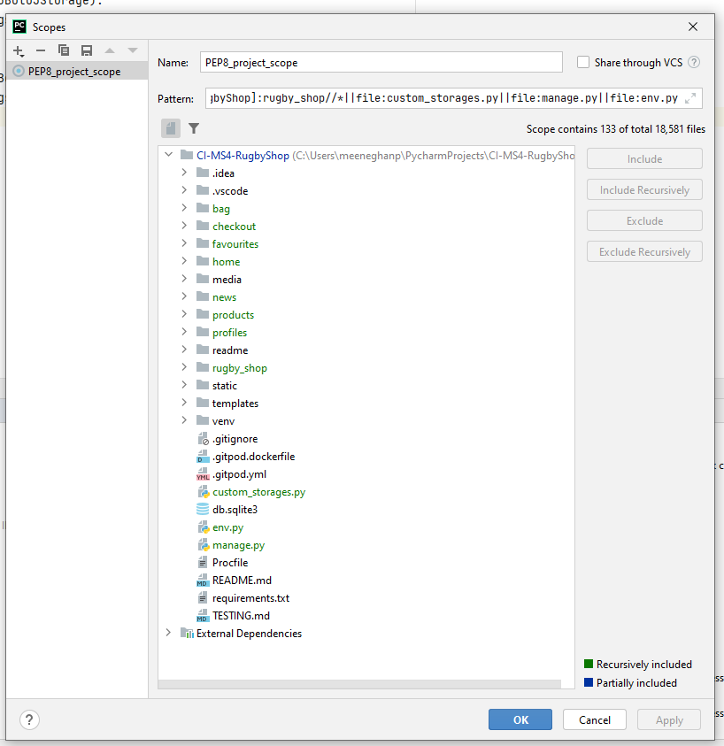
- The report shows no errors/warnings for the files listed below
 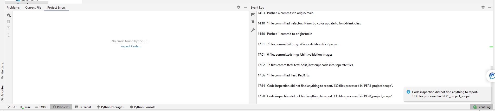
- One of the main errors on several files was to ensure the character count was less than 80 characters

Page | Result 
------------ | ------------- 
bag/admin.py | No errors/warnings 
bag/apps.py | No errors/warnings 
bag/contexts.py | No errors/warnings 
bag/models.py | No errors/warnings 
bag/test_views.py | No errors/warnings 
bag/urls.py | No errors/warnings 
bag/views.py | No errors/warnings 
checkout/admin.py | No errors/warnings 
checkout/apps.py | No errors/warnings 
checkout/forms.py | No errors/warnings 
checkout/models.py | No errors/warnings 
checkout/signals.py | No errors/warnings 
checkout/test_forms.py | No errors/warnings 
checkout/test_models.py | No errors/warnings 
checkout/test_views.py | No errors/warnings 
checkout/urls.py | No errors/warnings 
checkout/views.py | No errors/warnings 
checkout/webhook_handler.py | No errors/warnings 
checkout/webhooks.py | No errors/warnings 
favourites/admin.py | No errors/warnings 
favourites/apps.py | No errors/warnings 
favourites/contexts.py | No errors/warnings 
favourites/models.py | No errors/warnings 
favourites/test_models.py | No errors/warnings 
favourites/test_views.py | No errors/warnings 
favourites/urls.py | No errors/warnings 
favourites/views.py | No errors/warnings 
home/admin.py | No errors/warnings 
home/apps.py | No errors/warnings 
home/models.py | No errors/warnings 
home/test_views.py | No errors/warnings 
home/urls.py | No errors/warnings 
home/views.py | No errors/warnings 
news/admin.py | No errors/warnings 
news/apps.py | No errors/warnings 
news/forms.py | No errors/warnings 
news/models.py | No errors/warnings 
news/test_models.py | No errors/warnings 
news/test_views.py | No errors/warnings 
news/urls.py | No errors/warnings 
news/views.py | No errors/warnings 
products/admin.py | No errors/warnings 
products/apps.py | No errors/warnings 
products/forms.py | No errors/warnings 
products/models.py | No errors/warnings 
products/test_forms.py | No errors/warnings 
products/test_models.py | No errors/warnings 
products/test_views.py | No errors/warnings 
products/urls.py | No errors/warnings 
products/views.py | No errors/warnings 
products/widgets.py | No errors/warnings 
profiles/admin.py | No errors/warnings 
profiles/apps.py | No errors/warnings 
profiles/forms.py | No errors/warnings 
profiles/models.py | No errors/warnings 
profiles/test_models.py | No errors/warnings 
profiles/test_views.py | No errors/warnings 
profiles/urls.py | No errors/warnings 
profiles/views.py | No errors/warnings 
custom_storages.py | No errors/warnings
env.py | No errors/warnings
manage.py | No errors/warnings
unit/unit.py | No errors/warnings
